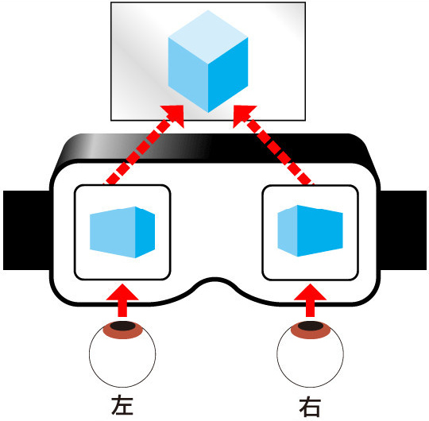

>
> 视频介绍：[VR家庭影院](https://www.bilibili.com/video/BV1FL41197u1)
>

### 项目简介

在VR场景中看高清影视，关键点是把VR眼镜当作一个超大屏幕/显示器使用。即解决了天冷躲被窝里感受超大屏幕看高清影视的问题，又顺便学习了VR的技术原理。

一句话说流程：把正在播放高清视频的电脑屏幕，通过家庭的WiFi局域网实时直播传输到手机浏览器，在VR场景的超大屏幕中观看高清影视。

有几个特点：

- 超大屏幕

	VR眼镜可以实现几米距离内几百寸的超大屏幕/显示器:-)

- 不限视频平台

	视频源来自电脑屏幕，各大视频平台都支持在电脑上的网页/客户端播放超高清视频，手机端不需要安装专用APP。

- 不限观看人数

	在家庭WiFi环境中，可以不需要大屏电视/投影仪，每人一个VR设备就可以在一起直播看大片（延时2秒左右）。

- 不限VR设备

	采用WebXR标准，从几十元的Google CardBoard兼容盒子，到几千元的一体机，到1万多的PC VR都可以使用。

### VR基础知识

- 原理

	- 大脑如何产生3D画面

		实际上，左右眼看到的是角度稍微有些差异的画面，大脑最终会合成3D物体的画面

		

	- 光学

		VR眼镜的光学原理上非常简单，就是一个凸透镜（有用多个透镜的方案，但是最终效果相当于一个凸透镜），眼睛在凸透镜的焦距内，能看到一个放大的虚像。
	
		

		- 问题

			光学原理只是理想状态下的效果，实际上透镜会产生像差的问题，使用过各种照相/摄影镜头的同学体会应该比较深:-)

			- 图像畸变`Distortion`
	
				透镜不同位置的折射角度是有差异的，常见的两种畸变

				桶形

				

				枕形

				

			- 色差`Chromatic Aberration`

				同一种材质对不同颜色光波的折射率是有差异的，所以成像边缘会出现色彩的现象

				原理

				

				效果

				

- 实现

	- 光学

		使用两个独立的透镜，让两个眼睛看到不一样的画面。所以在渲染同一个3D场景时，需要从稍微不同的角度渲染两次，然后输出两倍分辨率大小的画面。这样即增加了很多额外的算力需求，又对输出分辨率提出了更高要求。分辨率低容易出现`纱窗效应`
		
		

	- 解决像差

		每家厂商都有自己的反畸变/色差校正的算法，简单的参考Google `CardBoard`开源项目。所以不同厂商最终渲染出来的画面是有区别的，下面是没有任何处理的模拟器（上图）和`CardBoard`（下图）的效果对比：

		模拟器
		
		
		
		CardBoard

		

	- 标准

		`OpenXR`旨在标准化各种VR/AR平台上的设备和应用程序之间的规范。
		
		`WebXR`则允许在网络上开发和托管VR和AR体验。

		

### 项目依赖和操作流程

- 软硬件

	- PC服务端

		- 硬件

			笔记本或台式机电脑，显示分辨率越高越好。

		- 软件

			- 直播推流

				开源`OBS`软件
		
			- 直播服务

				开源`SRS`软件。运行环境选择`Docker`，需要安装`Docker Desktop`

	- 网络

		WiFi路由器，对内连接PC和手机，对外连接互联网。

	- 手机端

		- 硬件

			`Android`手机（苹果手机暂不支持`WebXR`）
			
			`CardBoard`兼容盒子（其实就是2个凸透镜）

		- 浏览器

			`Chrome`浏览器，版本>=79，否则不支持`WebXR`。

		- `CardBoard`VR设备层的驱动

			Google VR服务(`Google VR Services`)

		- 直播拉流

			直播视频播放器`flv.js`，`WebXR`框架`A-Frame`

- 操作流程

	- 安装依赖软件

		电脑上安装好`OBS`，`Docker Desktop`

		手机上安装好`Chrome`，`Google VR Services`
		
		其他软件在启动服务和网页时会自动安装

	- 下载代码

	- 启动服务

		执行代码根目录的服务脚本。Mac/Linux下运行`run-server.sh`，Windows下运行`run-server.bat`
		
	- 开始推流

		执行`OBS`，配置如下：

			流配置：服务器填写`rtmp://127.0.0.1/vr/`，Stream Key填写`hometheater`
			
			输出：码率填写`10000 Kbps`，局域网环境不在乎带宽:-)
			
			视频：输出分辨率，尽可能选择最高分辨率，如果CPU实在跑不动可以适当降低。原因参考下面的`VR基础知识->纱窗效应`。
			
			源：选择屏幕捕捉
			
			音频：选择桌面音频

	- VR播放视频

		手机上打开`Chrome`浏览器，地址栏输入`https://电脑IP:4443`
				
		点击右下角`VR`按钮，进入VR模式，并且开始自动播放直播视频
		
	最后把手机放在`CardBoard`盒子里面，带上观看即可
